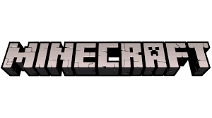

<!doctype html>
<html>
<head>
<link rel="style.css" type="text/css" media="screen" img="style.css"/>
</head>

<body

<h1>O minecraft foi fundado por Markus Persson, um programador sueco e bilionário, o jogo foi lançado em 2009

>